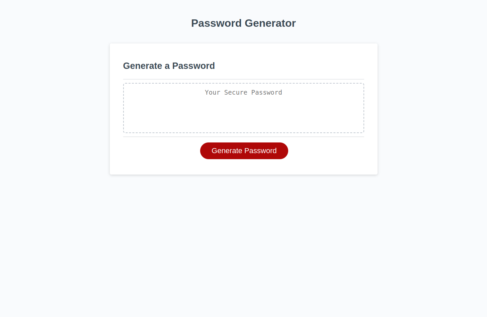

# Password Generator Challenge-03
## Description
For this project, I was tasked to create an application in which an employee could generate a password from characters they have chosen to include. My motivation was to use JavaScript to complete this task, something that was not familiar to me (and still isn't, to be honest) and I struggled quite a bit.

I began by reading through the assignment's acceptance criteria and really breaking it down into psuedo code in my file. Using my psuedo code as guide and referencing class material as well as documentation, I began with declaring necessary variables and prompting the user for their desired input values. I valiated inputs if I needed to (such as the password length), concatenated the user's desired options into an array, and then used the math.Random method to generate random values from the array of characters the user had chosen. I used console.log along the way to be able to track my code's function.

Finally, with the function to generate the password completed, I turned to the function to write the password to the page. I removed the variable declaration in the starter code as it was causing me trouble, simply calling generatePassword() instead and joined the password array's strings together as one value. From there, I applied the value of the generated password to the element on the page for the user to see!

## Usage
To use this password generator, simply click the generate password button to begin. Answer the prompts to select the criteria you wish for your password to meet and once you have answered all of them, your randomized password will appear in the text area.
## Credits
I recieved the starter code for this assignment from: [StarterCode](https://github.com/coding-boot-camp/friendly-parakeet)
## Screenshot

## Link to Live, Deployed Page
[Deployed Password Generator](https://josielynngriffin.github.io/password-generator-challenge-03/index.html)